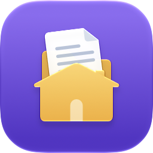
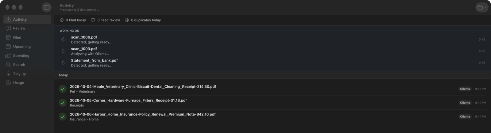

<p align="center"></p>

# HomeClerk

**Scan your paperwork; it's named and filed for you, by AI that stays on your Mac.**

Paper gets misplaced. Digital documents don't — but when the mail, the bills, the medical
statements, and the school forms keep coming, naming and filing every scan is its own chore.
HomeClerk does that part. Scan to a folder (or forward an emailed bill), and it reads each PDF,
works out what it is and who it's about, names it consistently, and files it where you'd look for
it. It runs on Apple's on-device model or a local Ollama model, so nothing leaves your Mac; for the
best accuracy, it can use Claude instead.

HomeClerk isn't where your documents live — it's what files them. You get plain folders you can open
in Finder, sync with iCloud Drive, and keep even if you stop using the app. On top of them it makes
each PDF searchable, tags it in Finder, keeps track of what's due, checks bills off as paid when
their receipts arrive, flags a bill that's higher than usual, and shows what you spend by vendor or
category.

> HomeClerk is a personal project, shared as is. Issues and pull requests are welcome, but there's
> no promise of support or timelines. What's changed in each release is in [CHANGELOG.md](CHANGELOG.md).



```
Inbox/scan0042.pdf  ──►  Organized/Vehicle - Tolls/2026-04-24-Toll_Authority-2021_Toyota_RAV4-Toll_Bill-31.40.pdf
                         + searchable text layer
                         + Finder tags: Vehicle · 2021 Toyota RAV4 · Tolls
                         + reminder: "Pay Toll Authority $31.40" on May 21
```

---

## Contents

- [How it works](#how-it-works)
- [Requirements](#requirements)
- [Getting started](#getting-started)
- [Using HomeClerk](#using-homeclerk)
- [Settings](#settings)
- [AI providers](#ai-providers)
- [Household profile](#household-profile)
- [Folders and the taxonomy](#folders-and-the-taxonomy)
- [File names](#file-names)
- [After filing](#after-filing)
- [Bills and spending](#bills-and-spending)
- [Review, duplicates, and Tidy Up](#review-duplicates-and-tidy-up)
- [Moving the HomeClerk folder](#moving-the-homeclerk-folder)
- [Storing documents in iCloud Drive](#storing-documents-in-icloud-drive)
- [Privacy and security](#privacy-and-security)
- [Troubleshooting](#troubleshooting)
- [Development](#development)

---

## How it works

```
Inbox (watched)
   │  wait until the scan has finished writing (size stable, ends with %%EOF)
   │  identical file already filed? ──► Tidy Up ▸ Duplicates
   │  needs a password? ──────────────► Review, to unlock
   ▼
Render pages (300 DPI) ──► OCR with Apple Vision
   ▼
AI reads the page images + OCR text and returns facts ("facets"):
   document type · area · tags · vendor · date · due date · expiry · amount · person · vehicle · pet
   │  model fails (outage, no credit, monthly limit)? ──► retry, then the fallback provider
   │  low confidence? ──────────────────────────────────► Review, with the model's proposal
   │  rescan of something already filed? ───────────────► Tidy Up ▸ Duplicates
   ▼
taxonomy.json rules turn the facets into a folder; code builds the file name
   │  several documents in one scan? ────► split and file each
   ▼
Organized/<folder>/<name>.pdf  →  text layer · Finder tags · reminders · Spotlight · index.jsonl
```

The AI never picks a folder or writes a file name directly. It reports facts; your rules decide
where things go. Changing the folder layout means editing `taxonomy.json`, not re-analyzing documents.

When you correct a document, HomeClerk can learn from it: it asks whether to remember what the
document said as the name you chose, so the next one files itself.

---

## Requirements

| | |
| --- | --- |
| A Mac with Apple silicon | macOS 14 or later; macOS 27 for Apple Intelligence as a reader and the layered icon's glass |
| Something to read documents | A Claude API key, or [Ollama](https://ollama.com) with a vision model, or Apple Intelligence |
| To build it | Xcode 27 or later (for the macOS 27 SDK), and [XcodeGen](https://github.com/yonaskolb/XcodeGen) (`brew install xcodegen`) |

---

## Getting started

```bash
git clone https://github.com/MockClan/HomeClerk.git
cd HomeClerk
./build.sh --install
```

`build.sh` builds `dist/HomeClerk.app` (and a zip of it); `--install` quits HomeClerk if it's running,
puts the new build in Applications, and opens it.

Or install a release with Homebrew — this repository is its own tap:

```bash
brew tap mockclan/homeclerk https://github.com/MockClan/HomeClerk
brew trust mockclan/homeclerk
brew install --cask homeclerk
```

(`brew trust` is how recent Homebrew lets a tap outside its own load; older versions skip it.)

(Or download the zip from [Releases](https://github.com/MockClan/HomeClerk/releases).) HomeClerk isn't
signed with an Apple Developer ID, so macOS blocks its first launch after each install or upgrade:
open it from Applications, then choose **Open Anyway** in System Settings ▸ Privacy & Security.

On a first run the **Setup Assistant** walks through the few decisions there are:

1. **Where documents live** — `~/HomeClerk` by default, or a folder in iCloud Drive.
2. **What reads them** — it starts from what this Mac can run: Claude when there's a key,
   otherwise Apple Intelligence or Ollama. For Claude it stores the API key in the Keychain; for
   Ollama it checks it's installed and running and downloads the model suggested for this Mac.
3. **Who's in the household** — a few names, or let HomeClerk ask as it meets them.
4. **How scans reach the Inbox** — the folder to point your scanner's app at.
5. **Ready** — add a made-up sample bill to watch it filed, and choose whether HomeClerk opens at
   login (off unless you turn it on).

Run it again any time from **HomeClerk ▸ Setup Assistant**.

If you build HomeClerk yourself, run `scripts/make-signing-cert.sh` once. It makes a self-signed
certificate, *HomeClerk Local*, in your login keychain, and `build.sh` signs with it from then on.
With the same signature on every build, macOS remembers what you've allowed HomeClerk (Reminders,
notifications) across updates instead of asking again. The first build afterwards may ask whether
`codesign` can use the key: click **Always Allow**. The certificate only matters on your Mac.

The app is ad-hoc signed ("sign to run locally"), not signed with an Apple Developer ID, so a copy
you build yourself opens normally, but one from Homebrew, a release, or another Mac is blocked by
Gatekeeper after each install or upgrade until it's opened with **Open Anyway** in System Settings ▸
Privacy & Security. `brew upgrade` picks up new releases; while the repository is private, tapping
needs a GitHub account with access to it.

---

## Using HomeClerk

HomeClerk lives in the menu bar and keeps watching the Inbox with its window closed. The window's
sidebar has eight sections (⌘1–⌘8):

| Section | What's there |
| --- | --- |
| **Activity** | What happened to each scan, by day — kept across restarts in `history.jsonl` — each with the engine that read it (Claude, Ollama, or Apple; orange when the fallback did), and scans being worked on, with their step and time. Banners say when something needs attention: Ollama not running, Claude's monthly limit reached, or nothing able to read documents |
| **Review** | Scans HomeClerk wasn't sure about, beside their pages, with the proposal as an editable form, and names HomeClerk has noticed but doesn't know (*Noticed*) |
| **Filed** | Every filed document, newest first, grouped like Mail, with an inspector: where it went, the scan it came from, the model and confidence, the summary, and what HomeClerk read. **Edit Details…** corrects it |
| **Upcoming** | Bills due and documents expiring in the next 30 days to a year, as a sortable table. Check a bill off when it's paid (a filed receipt does it for you); unpaid bills from the last month show as overdue, and an arrow flags one higher than usual. See [Bills and spending](#bills-and-spending) |
| **Spending** | What bills and receipts add up to each month, by vendor or by category, as a chart with totals and monthly averages. Double-click a row for its documents; **Export…** saves a CSV for Numbers or Excel |
| **Search** | Every filed document by any word — a detail HomeClerk read (vendor, person, vehicle, pet, tag, date) or anything printed on the page, shown with the line it's in — narrowed by person, vehicle, pet, year, or type; save searches you repeat |
| **Tidy Up** | Documents that need details, duplicates beside what they repeat, documents past their keep period, and old copies of scans in `_originals` — and a note if the HomeClerk folder doesn't look backed up |
| **Usage** | Claude calls and estimated cost by month and model, with the average cost per scan and the month against your limit |

Activity also shows **Review Repairs** when a filed document needs searchable text, Finder tags,
or Reminders. Open the affected document or retry its failed steps without refiling it. Repair
records survive restarts and follow document IDs through renames; retries use current details and
settings. Disabled steps remain pending. Tags are reapplied after searchable-text repair, and
successful reminder steps are not repeated. Raw errors stay local and are excluded from diagnostics.

With Reminders enabled, correcting a filed document or undoing that correction updates its managed
payment and expiration reminders: titles, dates, notes, and PDF links follow the document ID.
Existing reminders keep their completion state; a rename alone keeps their alarms. A changed due
date resets the alert to the morning of that date. Removing a reminder's date or amount removes
the associated reminder; undo can recreate it. Older reminders are migrated only when their
original title, date, notes, and PDF link match exactly. Ambiguous matches appear in Review Repairs.

### Getting documents in

- **A scanner** — set its app (or Image Capture's *Scan To*) to save PDFs into the Inbox. HomeClerk
  notices each one within a few seconds and waits until the scanner has finished writing it.
- **Your iPhone** — File ▸ Import From Device ▸ *your iPhone* ▸ Scan Documents (Continuity Camera).
  A photo instead becomes a one-page PDF.
- **Drag and drop** — PDFs from Finder, or attachments from Mail and Safari, onto the window or the
  Dock icon.
- **Finder** — right-click PDFs ▸ Services (or Quick Actions) ▸ **File with HomeClerk**.
- **Email** — Settings ▸ General ▸ **Set Up Mail…** installs a script for a Mail rule, then shows
  how to make the rule: pick the senders whose bills you want filed, and their PDF attachments land
  in the Inbox as they arrive.

A PDF that needs a password to open — statements banks and insurers email often are — waits in
Review unread. Type its password there and HomeClerk saves an unlocked copy and reads it as usual;
the password isn't kept.

### Correcting documents, and teaching HomeClerk

The same form corrects a document before it's filed (Review) and after (Filed ▸ Edit Details…):
vendor, what it is, type, area, dates, amount, person, vehicle, pet, and tags, with pickers from
the household. *Will be filed as* shows the folder and file name as you type, and the folder can
be overridden. Saving files it — or, for a filed document, renames and moves it to match. ⌘Z undoes.

After a correction HomeClerk asks, one question at a time, what it could learn:

- *"The document said 'P Example'. Remember it as **Pat Example** from now on?"* — adds an alias.
- *"Add **Jordan** to your household as a person?"* — adds a name.
- *"2 filed documents still use 'P Example'. Rename them?"* — updates past filings too.

Nothing is learned without a click. Review's **Noticed** list does the same for names HomeClerk met
on documents that filed fine — a person, pet, or vehicle it doesn't know, or a vendor spelled one
letter off one it does — without holding the documents up.

In Review you can also rotate a sideways or upside-down page (⌘L, ⌘R) — it's redrawn upright, so it's
searchable once filed — select several scans and **File N as Proposed** at once or **Combine into One Document** (for one
document a scanner saved as several files; pages join in list order), **Read Again** with
a different model (Claude for one a local model struggled with, say), and **Split into Separate
Documents** when one scan holds several, setting each one's pages. A misfiled document goes back
with Activity ▸ right-click ▸ **Send Back to Review**.

### Menus and shortcuts

| | |
| --- | --- |
| ⌘1 – ⌘8 | The sidebar's sections (Go menu) |
| ⌥⌘F | Search Documents, from anywhere |
| ⇧⌘I · ⇧⌘O · ⇧⌘R | Open the Inbox, Organized, or Review folder |
| ⌘↩ | File the selected Review scan (Document menu) |
| ⇧⌘P | Mark the selected bill paid, or not paid (Upcoming) |
| ⌥⌘A | Send it back to the Inbox |
| ⌘O · ⌥⌘R | Open it · Show it in Finder |
| ⌘L · ⌘R | Rotate the page showing left or right, as in Preview (Option-click the toolbar buttons, or Document ▸ Rotate All Pages, for every page) |
| ⌥⌘I | Show or hide the inspector (Review, Filed) |
| Space | Quick Look (Filed, Upcoming, Search) |
| ⇧⌘E | Export Tax Documents… |
| File ▸ Year in Review… | A year of paperwork at a glance: filed, spent, paid on time, what got dearer, what expired |
| Help ▸ What's New in HomeClerk | What the latest update added (shown once after an update) |
| Help ▸ Copy Diagnostics | A report for troubleshooting — versions, settings, readers, counts, and recent errors, with no documents, names, or API key |

### Notifications, the menu bar, and the rest of the Mac

- **Notifications** combine scans that arrive together (*"Filed 5 documents · 1 needs review"*).
  A filed bill that's higher than usual says so, and so does a receipt that pays a bill. The day
  before an unpaid bill is due, a notification says so, with **Mark as Paid** (unless Reminders is
  on, which already reminds you).
  On Mondays one says what's still unpaid or expiring that week, and whether scans have waited in Review for
  more than three days or names wait to be confirmed. Click one to open the right section.
- **The menu bar icon** shows whether HomeClerk is watching, busy, paused, or stuck, and its menu has
  what needs review, the five most recently filed documents, **Pause Watching**, and Quit. Closing
  the window keeps HomeClerk running there.
- **The Dock icon** badges the number of scans waiting in Review.
- **Spotlight** finds filed documents by vendor, person, vehicle, pet, or tag, not just their text.
- **Shortcuts and Siri** have *Find Documents*, *What's Due*, and *Review Scans* ("What's due in
  HomeClerk").
- **File ▸ Export Tax Documents…** copies a tax year's documents into one folder for an accountant,
  grouped as they're filed, with an `Index.csv` and, if you like, everything in one PDF.
- **File ▸ Year in Review…** sums up a year: documents filed by category and the busiest month,
  what was spent and with whom, the largest bill, how many receipt-matched bills were paid on time,
  which vendors' bills rose at least 5% on the year before, and what expired. **Copy Summary**
  puts it on the clipboard.

---

## Settings

**Settings** (⌘,) holds everything; changes take effect on their own.

| Tab | |
| --- | --- |
| **General** | The HomeClerk folder · keep a copy of each scan in `_originals` · open at login · show filed documents in Spotlight · emailed bills through a Mail rule |
| **Analysis** | What reads documents, and the fallback · Claude model · Claude's monthly spending limit ($0 for none) · Apple model (on-device or Private Cloud Compute) · how sure a model must be to file (70%, and 85% for the fallback) |
| **Ollama** | The model, chosen from what's downloaded and the recommended sizes, each with its memory, speed, and accuracy · how long the model stays in memory when idle (5 minutes unless you change it), what's loaded now, and Unload Now · the server address · start Ollama when it's needed |
| **After Filing** | The Monday summary · the day-before notice for bills · searchable text layer · Finder tags · reminders, their list, and how far ahead of an expiry |
| **Household** | People, groups, vehicles, pets, vendors, and notes (see [Household profile](#household-profile)) |
| **Rules** | Folder rules, keep periods, and suggested tags — your own copy of the taxonomy — and **Apply to Filed Documents** (see [Folders and the taxonomy](#folders-and-the-taxonomy)) |
| **API Key** | Store or remove the Anthropic API key, kept only in the Keychain |

Settings are stored in the app's preferences (the `com.mockclan.homeclerk` defaults domain), which
`homeclerk-dev` reads too. For testing, `HOMECLERK_HomeClerk__<Setting>` environment variables
override them — `HOMECLERK_HomeClerk__BasePath` for a scratch folder, say.

---

## AI providers

Choose what reads documents in Settings ▸ Analysis, and a fallback to take over when it fails — out
of API credit, a refusal, an outage, or Claude's monthly limit — instead of sending the scan to
Review. Fallback results must clear a higher confidence bar (85%), because local models are less
accurate and tend to be overconfident.

Accuracy below is from the project's test set of 27 real household documents with tricky cases
(fraction of facts correct):

| Provider | Model | Accuracy | Cost | Speed | Notes |
| --- | --- | --- | --- | --- | --- |
| Claude | `claude-sonnet-5-5` (default) | **98%** | ~1.5¢ / document | ~5 s | Reads the page images; matches vehicles by VIN |
| Claude | `claude-opus-5-5` | 96% | ~3¢ / document | ~5 s | |
| Ollama | `qwen3-vl:8b-instruct` | 87% | free | ~23 s | Local with a local server and local model. Use an **instruct** build — `qwen3-vl:8b` is a reasoning build that is far slower |
| Apple | on-device Foundation Model | 69% | free | ~15 s | Fully local; small context window. Not accurate enough to file on its own yet |

**Claude** needs an API key from console.anthropic.com, stored in Settings ▸ API Key (or the Setup
Assistant). A **monthly spending limit** stops HomeClerk using Claude once a month's estimated cost
reaches it — a notification warns at 80% — and Usage shows the month against it.

**Ollama**: `brew install ollama`, or the app from ollama.com. Settings ▸ Ollama lists the models
you've downloaded and four Qwen3-VL sizes, suggests the largest that fits this Mac's memory
comfortably, and downloads one with a progress bar. Each shows the memory it needs, its speed
(measured per document on this Mac once used), and its accuracy (how many documents it filed without
needing Review or a correction, once there are five). HomeClerk can start `ollama serve` while it's
open and stop it on quit.

**Apple** needs macOS 27 with Apple Intelligence turned on. It chooses person, vehicle, and pet only from your household (or none), so it won't suggest new names the way Claude and Ollama can.

---

## Household profile

`~/HomeClerk/household.json` tells HomeClerk what a document can't: who lives here, the groups they
belong to, which vehicles and pets you have, and how to treat familiar vendors. Names in the profile
become the canonical names in file names, and HomeClerk maps what the model writes onto them —
`JANE_A_SMITH`, `jane smith`, and an alias all become `Jane_Smith`.

Edit it in **Settings ▸ Household**, which shows which aliases were learned from corrections and
when — or let it fill in from Review's questions. The file looks like this
([`Resources/household.example.json`](Resources/household.example.json) is a fuller example):

```json
{
  "people":   [ { "name": "Jane_Smith" }, { "name": "Sam_Smith", "aliases": ["Samuel Smith"] } ],
  "groups":   [ { "name": "Troop_101", "aliases": ["Unit 101"] } ],
  "vehicles": [ { "name": "2021_Toyota_RAV4", "vin": "2T3P1RFV0MC000000", "plates": ["ABC1234"] } ],
  "pets":     [ { "name": "Biscuit", "notes": "dog" } ],
  "vendors":  [
    { "name": "AHP", "aliases": ["Acme Health Plan"] },
    { "name": "Acme_Pay", "notes": "installment loan — area Financial with tag loan" }
  ],
  "notes": [ "Hardware store receipts for the rental go under area Home with tag rental" ]
}
```

Documents about a whole group — a troop's swim test record, a team roster — are named for the group
rather than whichever member, leader, or signer appears on them; list groups so the name is
consistent (`Unit 101` on the form files as `Troop_101`). Vehicles are matched by VIN when one is
printed. Vendor `notes` steer classification for vendors whose documents are easy to misread. The
file holds personal data, so it lives in the HomeClerk folder, readable only by your account, and
never in the repository. Saving it from the app keeps any fields it doesn't edit.

---

## Folders and the taxonomy

The taxonomy defines the following. HomeClerk starts from the one built into the app
([`Resources/taxonomy.json`](Resources/taxonomy.json)); editing it in **Settings ▸ Rules** saves your
own copy as `taxonomy.json` in the HomeClerk folder, which updates leave alone. If your copy has a
problem, Activity says so and the built-in rules are used until it's fixed; **Use Built-in…** moves
your copy to the Trash.

- **Document types** (21) — Bill, Statement, Receipt, Explanation of Benefits, Prior Authorization,
  Appeal, Claim, Policy, Tax Form, Tax Return, Pay Stub, Notice, Contract, Certificate, Record,
  Prescription, Form, Report, Warranty, Manual, Other
- **Areas** (18) — Medical, Insurance, Financial, Taxes, Utilities, Home, Vehicle, Devices, Pet,
  Education, Employment, Government, Legal, Security, Scouting, Shopping, Charity, Other
- **Suggested tags** (43) — e.g. `dental`, `tolls`, `loan`, `data-breach`, `title`, `work-expense`
- **Rules** — checked top to bottom; the first match decides the folder
- **Keep periods** (`retention`) — how long each kind of document is worth keeping
- **Tax documents** (`taxDocuments`) — what the tax export gathers besides the Taxes area

```json
{ "folder": "Vehicle - Tolls",  "tagsAny": ["tolls"] },
{ "folder": "Medical - Dental", "area": "Medical", "tagsAny": ["dental"] },
{ "folder": "Medical - Bills",  "area": "Medical", "types": ["Bill", "Statement", "Receipt"] },
```

A rule can require an `area`, any of several `types`, and any of several tags (`tagsAny`). Put rules
that match on a tag alone — like tolls, data breaches, or work expenses — near the top, or an area rule above them
will catch those documents first. A document that matches no rule goes to a folder named after its
area; one with no details at all lands in the catch-all (`Uncategorized`) and is listed in
Tidy Up ▸ Needs Details.

Keep periods use the same conditions, first match wins, with `keepYears: null` for keep
indefinitely — utility bills a year once paid, tax records seven years, titles, policies, a
vehicle's service history (it supports resale value), and home repairs and improvements
(improvements raise the home's cost basis when you sell), and devices' purchase and repair records
(for warranty, insurance, or resale) for good. Anything tagged `work-expense` — filed together in
Employment - Expenses, whatever it's about — is kept three years. They're suggestions shown in
Tidy Up, never acted on by themselves:

```json
{ "when": { "area": "Utilities", "types": ["Bill", "Statement"] }, "keepYears": 1, "reason": "Once paid, the next bill confirms it." }
```

Rules are checked as you edit them, and an invalid set is never saved. After changing them,
**Apply to Filed Documents…** lists the filed documents the rules would now put elsewhere (or name
differently), from the details HomeClerk already has — nothing is read again by a model — and moves
the ones you leave ticked; ⌘Z puts them back. To have a model re-read documents filed earlier, use
[`backfill`](#homeclerkkit). Types and areas, and the tax-document list, are edited in the file.

---

## File names

File names are built from the facets, not written by the model:

```
Date-Vendor[-Person][-Vehicle][-Pet]-Description[-Amount].pdf
```

```
2026-01-14-Summit_Neurology-Jane_Smith-Patient_Statement-120.50.pdf
2026-04-15-Acme_Auto_Finance-2021_Toyota_RAV4-Auto_Loan_Statement.pdf
2027-03-16-Sunny_Vet-Biscuit-Rabies_Vaccination_Certificate.pdf
Undated-Private_Seller-2011_Honda_Civic-Bill_of_Sale.pdf
```

- **Date** is the date printed on the document — never the day it was scanned. A year alone is
  kept as `1987-…`; a document with no date is named `Undated-…`.
- **Vendor** uses the household profile's canonical name when listed; otherwise legal suffixes
  (Inc, LLC…), "of <State>" qualifiers, and a leading "The" are dropped.
- **Amount** is added for bills and receipts, and for medical statements and prior authorizations.
- A repeated segment is skipped, and a clash with an existing file gets `_2`, `_3`, ….

---

## After filing

Filing keeps the source until every output PDF and its index record are saved. Splits save
all their index entries together. A private recovery journal lets HomeClerk reconcile interrupted
filings before watching Inbox again. If a source or output has changed unexpectedly, recovery
preserves it, reports the problem in Activity, and carries on starting — the stuck filing waits in
Tidy Up ▸ Library Health. Cleanup warnings appear in Activity. Filing a scan in a
chosen folder without an AI proposal also records it in the Library.

Managed document folders and PDFs must be ordinary folders and files, rather than symbolic
links. HomeClerk rejects linked category folders, including links to another location inside
Organized, and excludes linked PDFs from Inbox processing, Review, and the Library. Replace a
link with an ordinary folder and copy the documents into it to use that location. macOS path
aliases above the archive, such as `/var` and `/private/var`, remain supported.

| Step | Default | What it does |
| --- | --- | --- |
| Searchable PDF | on | Adds an invisible text layer to image-only pages, including scanned pages in a mixed text/scanned PDF. Pages with selectable text are retained without another OCR layer; page images stay unchanged |
| Finder tags | on | Tags each file with its area, person, vehicle, pet, and tags — click `2021 Toyota RAV4` in the Finder sidebar to see every document about the car. Tags sync through iCloud Drive |
| Reminders | **off** | "Pay <vendor> <amount>" on a bill's due date, and "<pet/vehicle/person>: <document> expires <date>" 30 days before an expiry, in a "HomeClerk" list; duplicates are skipped. macOS asks for permission the first time |
| Spotlight | on | Indexes each filed document with its vendor, person, vehicle, pet, and tags, on this Mac only |
| Index | always | Appends each filed document's facets to `~/HomeClerk/index.jsonl` — what Filed, Search, Upcoming, and Tidy Up read |

Rotation in Review changes the page rotation flag instead of redrawing the page. Before rotation,
unlocking, or searchable conversion rewrites a PDF, HomeClerk keeps its exact original bytes. For
searchable conversion of a just-filed scan, the copy in `_originals` already is that; otherwise they
go in `.homeclerk-pdf-originals` beside the PDF. These private copies are saved even with
scanner-original storage off and are never offered for automatic cleanup. Review's **PDF Originals** button and
file menus' **Show PDF Originals** open the folder; Finder's **Command-Shift-.** also reveals it.
Copies use their SHA-256 as the filename; adjacent JSON records identify the source name and
operation. To recover one, copy it elsewhere and open it before replacing a working document.
Unlocking keeps the encrypted original, so recovering it still requires its password.

PDF rewriting cannot guarantee preservation of every structure. Unlocking redraws pages and may
remove links, annotations, or bookmarks. Searchable conversion retains tested page geometry and
annotations, but other structures may change. PDFs containing an AcroForm or interactive widget,
including signature fields, are refused when a transformation would rewrite them. Filing can
still retain the unchanged PDF; a failed searchable step is visible in Activity. Backup failures
also prevent the rewrite. Copies stay in their original folder when the working PDF is moved;
there is no automatic restore or backup migration. Transformations use extra disk space, so
review these folders manually when managing archive storage.

---

## Bills and spending

Bills come from what HomeClerk already reads — the vendor, amount, and due date — so there's nothing
to enter.

- **Paid.** A bill counts as paid when a receipt matches its vendor and amount, dated from 60 days
  before the due date to 45 days after and no earlier than the bill's issue date when known. Person,
  vehicle, and pet mustn't conflict: two different names make it a suggestion to confirm, and so
  does a receipt that names none when the vendor's documents mention several (two cars on one
  insurer); a receipt that names no one otherwise fits. Each receipt pays the bill
  whose due date it's closest to, so months of a fixed bill pair up month by month; a receipt equally
  close to two bills stays a suggestion. Check or uncheck a bill in Upcoming to decide yourself; your choice
  wins over any receipt and follows the document's persistent ID through corrections and renames.
  It is kept in `paid.json` in the HomeClerk folder. Older marks are retained at their recorded document
  paths and upgraded when you edit those documents; marks from earlier renames cannot be safely
  recovered by matching vendor and amount alone and may need to be set again.
  Statements with a payment due can be checked off too, with ⇧⌘P, and ⌘Z undoes it. With Reminders
  on, a bill's *Pay …* reminder is ticked off when it's paid, and reopened if you uncheck it.
- **Overdue.** Unpaid bills due in the last 30 days stay in Upcoming, in red, until they're checked
  off. **Show Paid** brings back the paid ones.
- **Higher than usual.** A bill at least a quarter more, and at least $10 more, than the median of
  the vendor's last six bills (with at least three to go on) is flagged in Upcoming and in its Filed
  notification, with the usual amount.
- **Spending** adds up bills, plus receipts that didn't pay a bill (so paying a bill isn't counted
  twice), by the month on the document. Statements are left out — their amounts are balances. The
  seven largest vendors or categories get their own color; the rest are *Everything else*.
  Ambiguous receipts remain separate from bills in these totals until a match can be established;
  marking a bill paid by hand does not link a receipt to it.

**Upcoming → Review Receipt Matches** shows the bill and receipt PDFs side by side, with the
vendor, amount, dates, household subjects, and reasons for the proposal. Review ambiguous pairs
or subject differences, and inspect automatic matches too. **Confirm Match** links one bill to
one receipt; **Reject Match** excludes that pair. **Reset Decision** returns it to automatic
matching. These actions support Undo. Hand paid/not-paid marks still take priority.

Decisions are saved privately in `receipt-matches.json` by document ID, so renames and re-analysis
keep your choice. Confirmed links remain explicit even if later details differ; the review view
shows that difference. A confirmation stays inactive/reserved while its documents are unavailable
or no longer have payable bill/receipt roles. **Review Saved Decisions** lets you reset unavailable
pairs without restoring a deleted PDF. Last recorded filenames are hints, not file locations.
Unreadable decision history suspends receipt matching and shows a warning; the file is preserved.
Spending excludes a linked receipt only when its bill is itself counted, so a payment linked to a
statement is still counted once through the receipt. This supports one-to-one payments, not
partial payments or one receipt paying several bills.

---

## Review, duplicates, and Tidy Up

**Review** (`~/HomeClerk/_review`) holds scans HomeClerk shouldn't file on its own, each with the reason
— confidence below the bar, an unreadable or password-protected PDF, or every provider failing — and, when the model read
it, its proposal (see [Correcting documents](#correcting-documents-and-teaching-homeclerk)). A scan
with nothing filled in says where it'll land (*File in Uncategorized*) before you file it.

Review and Filed keep unsaved edits when you change selection or visit another screen during the
current app session. Returning to the document restores its draft. Revert, Cancel, or an action
that replaces those edits asks before discarding meaningful changes. Drafts are not saved across
app restarts. Conflicting document actions are disabled while work runs; failed saves keep your
draft, and a Filed draft based on older details must be reloaded before saving.

**Duplicates** (`~/HomeClerk/_duplicates`) are scans already filed. Two checks:

- **Identical file** — the same bytes dropped in twice. Caught before any AI call.
- **Rescan** — the OCR text is nearly identical *and* vendor, date, person, amount, vehicle, and pet
  all match. Text alone isn't enough: the same letter sent to several family members, or a monthly
  statement, differs only in a name or date — those are filed, not treated as duplicates.

**Tidy Up** gathers what's worth a look:

Its **Library Health** button (also **File ▸ Check Library Health…**) checks the Library against
your folders: PDFs that aren't recorded, records whose PDF is no longer there, stale duplicate
matches, interrupted filings, and failed finishing steps. Choose an item to see its paths and what
the fix does — **Add to Library** (with details to fill in later, in Needs Details), **Remove
from Library** (for a PDF deleted or filed again as a new copy when re-processed), **Clear
Match**, or **Recover Filing** — or do all of one kind at once. **Sync with Folders…** does
every add, remove, and clear in one go. HomeClerk pauses watching while it repairs and carries on
afterwards, and Undo puts it back. Finishing items link to Activity's existing retries.
Unreadable or unsafe data stays visible for manual review; scanning never changes the archive.
This checks metadata and file presence, rather than every PDF's contents or backup integrity.

- **Needs Details** — filed documents with too little to go on: in the catch-all folder, or with
  neither a vendor nor a description. **Edit Details…** opens one in Filed ready to edit; **Read
  Again** sends it back through Review with a model you choose; **Leave As Is** stops listing it.
- **Duplicates** — each beside the document it repeats. **Not a Duplicate** sends it to Review to
  file as its own document; **Move to Trash** discards it.
- **Past Keep Period** — documents older than their [keep period](#folders-and-the-taxonomy), with
  the reason. **Keep** stops suggesting one; **Keep All Like This** keeps every document of
  that area and type indefinitely, adding a keep period at the top of Settings ▸ Rules (⌘Z takes
  it back); **Move to Trash** discards it.

- **Originals** — preserved copies older than 90 days with verified, complete filed outputs,
  with their sizes. Each new copy has a private identity/hash record. Filing records every output's
  document ID, page range, and hash after finishing; Tidy Up checks the original and all current
  outputs before offering cleanup, and checks again before Trash. Renaming a filed document
  keeps the link through its document ID. Changed/missing outputs, incomplete splits, unreadable
  records, and older copies without provenance are retained. Interrupted proof recording and
  manually edited or combined scans can also leave copies retained. **Move to Trash** clears
  verified copies; the filed documents stay. Copies from before HomeClerk kept these records are
  offered separately, with **Move Older Copies to Trash…** after a confirmation, when there's
  evidence they were filed (their exact bytes in the duplicate list, or a filed document from a scan
  of the same name); copies without evidence are kept.

Anything moved to the Trash goes to Finder's Trash, so ⌘Z or Finder's Put Back brings it back.

---

## Moving the HomeClerk folder

The Library records each document relative to the HomeClerk folder, so the folder can live anywhere
and move whenever you like:

- **Settings ▸ General ▸ Move…** moves it for you — to a new name, another drive, or iCloud Drive.
  HomeClerk stops watching, moves everything (on another drive it copies, checks the copy, and puts
  the original in the Trash), and carries on from the new place. Reminders' links, the Mail script,
  and Spotlight follow it.
- **Moved it yourself** in Finder? At its next start HomeClerk asks where the folder went
  (**Locate…**) instead of starting an empty one, and picks up from there.
- **Choose…** is different: it switches to another folder and leaves the current one as it is.

## Storing documents in iCloud Drive

To keep documents in iCloud Drive (on your other devices, and backed up), choose or move a HomeClerk
folder there — in the Setup Assistant or Settings ▸ General. Text layers and Finder tags sync along with
the files, so search and tags work on every Mac. A few things to know:

- The Inbox, Review, and `_originals` (a second copy of every scan) sync too; turn off *Keep a copy
  of each scan* if you'd rather not store each scan twice.
- With **Optimize Mac Storage** on, macOS may replace older documents with placeholders. Search,
  Filed, and Upcoming still work (they read `index.jsonl`), but opening a file downloads it first.
- Run HomeClerk on **one Mac** at a time for a given folder. Two copies on the same Mac refuse to
  share a folder; two Macs can't tell, and would both file each scan.

---

## Privacy and security

- **Primary and fallback readers can see your documents.** Claude sends document text and the PDF
  to Anthropic's API. Ollama sends text and page images to the configured server: a remote address
  sends them off this Mac, and remote HTTP lacks transport encryption. A loopback server can also
  forward requests or use cloud models; local processing requires both a local server and a local
  model. Apple on-device processing runs on this Mac; Private Cloud Compute is a separate choice.
  A fallback is used automatically when the primary fails, so a local primary with Claude fallback
  can send documents to the cloud. Settings ▸ Analysis and setup show both destinations. To avoid
  automatic cloud fallback, choose no fallback or an appropriately configured local reader. There
  is also a **Use local readers only** toggle in Analysis and setup. It blocks Claude, Apple Private
  Cloud Compute, remote Ollama, cloud-named Ollama models, and HTTP redirects for document analysis,
  including fallback, Review re-analysis, and developer eval. Allowed Ollama requests use loopback
  without an explicit network proxy; localhost is pinned to 127.0.0.1. This restricts HomeClerk's
  destinations, not forwarding performed by a local server, model behavior, or unrelated network
  features such as model downloads. Enabling restarts watching immediately; already sent requests
  cannot be recalled. If no permitted reader succeeds, the scan remains in Review.
- **The HomeClerk folder is private to your account.** HomeClerk creates or tightens it, and the folders
  inside it, to `700` on start. Its own files that hold personal details — `household.json`,
  `noticed.json`, `paid.json`, `history.jsonl`, `finishing-issues.json`, and the search cache — are created `600`, never
  readable by another account even for a moment.
- **PDF passwords are used once.** Unlocking a protected PDF in Review saves a copy without the
  password; the password itself isn't stored or logged.
- **The Mail script only saves PDFs.** It runs for the messages your Mail rule picks, saves their PDF
  attachments into the Inbox, and does nothing else; it's `Send PDFs to HomeClerk.scpt` in
  `~/Library/Application Scripts/com.apple.mail`.
- **Back up the HomeClerk folder.** Once the paper's shredded, it's the only copy. Tidy Up says so if
  the folder isn't in iCloud Drive, included in Time Machine, or on a Mac with Backblaze; with
  another backup, click **I Back Up Another Way**.
- **The API key is kept only in the Keychain**, written through `security`'s standard input so it
  never appears in shell history or the process list.
- **One HomeClerk per folder.** A lock file stops a second copy watching the same folder, which would
  read — and pay for — each scan twice.
- **Spotlight and notifications** show document details on this Mac: Spotlight can be turned off in
  Settings ▸ General, and notification previews in System Settings ▸ Notifications.
- **Exports are plain text where it matters**: text read from a document that looks like a
  spreadsheet formula is written to the tax export's `Index.csv` as text, not as a formula.
- **Activity's history** (`history.jsonl` in the HomeClerk folder) names your documents, so it's readable
  only by your account; it keeps the newest 5,000 events.
- **Search's text cache** (`.homeclerk-cache/fulltext.json` in the HomeClerk folder) holds the words
  printed in filed documents, so it's readable only by your account like the documents themselves.
- **Logs** go to the unified log under `com.mockclan.homeclerk`, with file names and personal details
  marked private.
- **Personal data never belongs in the repository**: `household.json`, `index.jsonl`, scans, and the
  test set all live outside it, and `.gitignore` blocks PDFs and `expected.json` as a backstop.

---

## Troubleshooting

| Symptom | Cause and fix |
| --- | --- |
| Activity says HomeClerk can't read documents yet | Nothing configured can run here — Claude without a key, Ollama not installed, or Apple Intelligence unavailable. **Set Up…** fixes it |
| Every scan goes to Review with an API error | Out of credit or an invalid key. Add credit, or store the key again in Settings ▸ API Key. With a fallback set, scans use that reader meanwhile; check its destination in Settings ▸ Analysis |
| Scans go to Review saying Claude's limit is reached | The month's estimated cost reached Settings ▸ Analysis ▸ Claude spending limit. Raise it, or wait for next month |
| Reminders are never created | Turn them on in Settings ▸ After Filing and allow access when macOS asks. If macOS asks again after every rebuild, run `scripts/make-signing-cert.sh` once (see [Getting started](#getting-started)) |
| "Another copy of HomeClerk is already watching this folder" | Quit the other copy — one from Xcode, say — then reopen HomeClerk |
| macOS says HomeClerk.app "can't be opened" | A copy built on another Mac isn't Developer ID–signed. Open it once, then choose **Open Anyway** in System Settings ▸ Privacy & Security |
| First scan after a macOS update comes back blank | Vision loads its model on first use; HomeClerk waits up to 2 minutes and retries once. Try again if it still failed |
| Ollama takes minutes per document | You have a reasoning build like `qwen3-vl:8b`. Choose an **instruct** build in Settings ▸ Ollama |
| Emailed bills don't reach the Inbox | Check the rule in Mail ▸ Settings ▸ Rules runs the *Send PDFs to HomeClerk* script and matches the sender. If you changed the HomeClerk folder, click **Update for This Folder** in Settings ▸ General |
| A bill paid weeks ago still shows as due | No receipt matched it (a different amount, or a vendor spelled differently). Check it off in Upcoming |
| A document you expected went to Duplicates | Tidy Up ▸ Duplicates shows it beside the original. If it's really different, choose **Not a Duplicate** |
| Something's wrong and you want help | **Help ▸ Copy Diagnostics**, then paste the report into an email or issue |
| The Dock still shows the old icon after an update | macOS caches icons; quit and reopen HomeClerk, or log out and back in |

---

## Development

### Building and testing

```bash
./build.sh                      # the Swift app in dist/HomeClerk.app, plus a zip of it
./build.sh --install            # …and into Applications, then open it
cd HomeClerkKit && swift test    # HomeClerkKit's tests
```

Every pull request, and every push to `main`, runs the tests and builds the app on GitHub
(`.github/workflows/test.yml`).

`build.sh` runs `xcodegen`, then `xcodebuild` into `build/xcode`; `--clean` starts fresh and
`--debug` builds the Debug configuration. `VERSION=v1.2.0 ./build.sh` stamps a version into the app
(otherwise the latest git tag, or "dev"). It signs with the *HomeClerk Local* certificate when it's in
your keychain, and ad hoc otherwise, as on GitHub's release runners; `SIGN_IDENTITY` picks another.

### HomeClerkKit

[`HomeClerkKit/`](HomeClerkKit) is the Swift package with everything but the window: the taxonomy and
folder rules, file names, the household profile, duplicate detection, the prompt and response
schema, the AI analyzers (Claude over the HTTP API, Ollama, and Apple Foundation Models
in-process), OCR, the pipeline, review and refiling, the library, bills and spending, keep periods,
the tax export, PDF tools (split, rotate, unlock), the Mail rule script, and the accuracy eval.

`ParityTests` checks the prompt, schema, folders, file names, and parsing against reference outputs
for fictional inputs (`Tests/HomeClerkKitTests/Fixtures`), produced by HomeClerk's original C#
version. A difference is a change in behavior; when one is intended, update `parity-expected.json`
to match. The same checks run on any other input/expected pair with `HOMECLERK_PARITY_DIR=<folder>` —
for example one built from your own filed documents, kept outside the repository.

`homeclerk-dev` has the eval and the maintenance commands:

```bash
cd HomeClerkKit && swift build -c release --product homeclerk-dev && cd ..
HomeClerkKit/.build/release/homeclerk-dev eval --analyzer ollama --label swift-ollama
HomeClerkKit/.build/release/homeclerk-dev eval --analyzer claude --only case-id --allow-spend
HomeClerkKit/.build/release/homeclerk-dev backfill plan --analyzer ollama --match swim 2025
HomeClerkKit/.build/release/homeclerk-dev backfill apply ~/HomeClerk/backfill/plan-….json
HomeClerkKit/.build/release/homeclerk-dev backfill undo ~/HomeClerk/backfill/backfill-undo-….json
HomeClerkKit/.build/release/homeclerk-dev rebuild-duplicate-index
```

**Backfill** brings documents filed earlier up to date after improving the rules or the model: it
re-analyzes everything in `Organized` (or just paths containing every `--match` word), writes a
reviewable plan (`~/HomeClerk/backfill/plan-*.md` and `.json`), and moves nothing until you apply the
entries marked `"apply": true`; undo restores their file paths. New undo logs include the SHA-256
hash of each finished PDF and are stored privately with unique filenames. Undo validates the
whole log before moving anything: paths must be absolute PDF paths inside Organized, without
symlinks or traversal. Changed files, missing files, and destination conflicts are reported and
preserved. Older logs without hashes are refused because their file contents cannot be verified;
keep them for reference rather than adding guessed hashes. New logs save the previous index
entry and duplicate records before each operation, including keep-in-place changes. Undo restores
those snapshots, preserves document/payment identity, and refuses to replace later metadata edits.
Previously unindexed files return to that state. Saving undo progress makes retries safe after
partial failure; duplicate-record repair can be retried without moving the file again. Hash-only
logs from earlier versions can restore paths, but have no snapshots to restore metadata or duplicate
records. Finder tags, searchable text layers, and created Reminders remain after undo. Analyses
are cached, so re-planning is free. **Paid commands are opt-in**: `backfill plan` and `eval` with Claude print an estimated cost
and refuse to run without `--allow-spend`. Commands that move files or rewrite the duplicate index
won't run while HomeClerk.app is open.

### Working in Xcode

`HomeClerk.xcodeproj` holds the app (`App/`, which runs everything through HomeClerkKit). It's
generated from
[`project.yml`](project.yml) by XcodeGen; after adding or renaming a Swift file, run `xcodegen`.
Xcode must be the active developer directory (`sudo xcode-select -s /Applications/Xcode.app`).

- **Run it:** choose the **HomeClerk** scheme and press ⌘R. Quit any installed copy first — only one
  HomeClerk may watch a folder. To use a scratch folder instead of your real `~/HomeClerk`, open
  Product ▸ Scheme ▸ Edit Scheme ▸ Run ▸ Arguments and tick `HOMECLERK_HomeClerk__BasePath`.
- **Preview the window:** open `App/Model/PreviewData.swift` and show the canvas (⌥⌘↩).
- **Test:** Product ▸ Test (⌘U) runs HomeClerkKit's tests, the same ones as `swift test`. Results
  show in the Test navigator (⌘6); click the diamond beside a test to run just that one.
- **Debug:** set a breakpoint and ⌘R. HomeClerkKit logs to the unified log — watch it with
  `log stream --predicate 'subsystem == "com.mockclan.homeclerk"'`.

### The icon

[`icon/`](icon) holds it as layers — the folder's back, the page, and the folder's front — and
`icon/HomeClerk.icon`, the Icon Composer file the app uses, from which macOS draws the light, dark,
clear, and tinted appearances. After editing a layer, `icon/update-icon.sh` updates `HomeClerk.icon`
and renders `appearances.png`. See [`icon/README.md`](icon/README.md).

### Measuring accuracy

`eval` scores a provider against a private test set in `~/HomeClerk-TestData` — real scans plus an
`expected.json` of the correct facts, kept outside the repository. Each run writes a report to
`runs/`, and OCR is cached so repeat runs only pay for the model. Run it before and after changing
the prompt, the taxonomy, or the model.

### Project structure

```
App/                 The Mac app (SwiftUI) and its Info.plist
  HomeClerkApp.swift    The app, its menus (Commands.swift), and its delegate
  Model/               HomeClerkModel — the window's state and pipeline events — and its extensions:
                       household, notifications, Spotlight and Shortcuts, diagnostics, previews
  Screens/             One file per section, plus the Setup Assistant and the menu bar menu
  Settings/            The Settings window's panes
  Components/          Pieces the screens share: Page, the correction form, the PDF view
  Support/             DefaultsKey, every preference the app keeps
HomeClerkKit/         The Swift package with HomeClerk's logic, its tests, and homeclerk-dev
Resources/           taxonomy.json (document types, areas, tags, folder rules, keep periods) and
                     household.example.json
icon/                The icon's layers and HomeClerk.icon
project.yml          Xcode project definition (HomeClerk.xcodeproj is generated from it)
build.sh             Builds (and installs) the app
scripts/             make-signing-cert.sh, the one-time local signing setup
Casks/homeclerk.rb    The Homebrew cask; .github/workflows/release.yml builds releases and updates it
.github/workflows/   test.yml (tests on every pull request) and release.yml (tagged releases)
```
